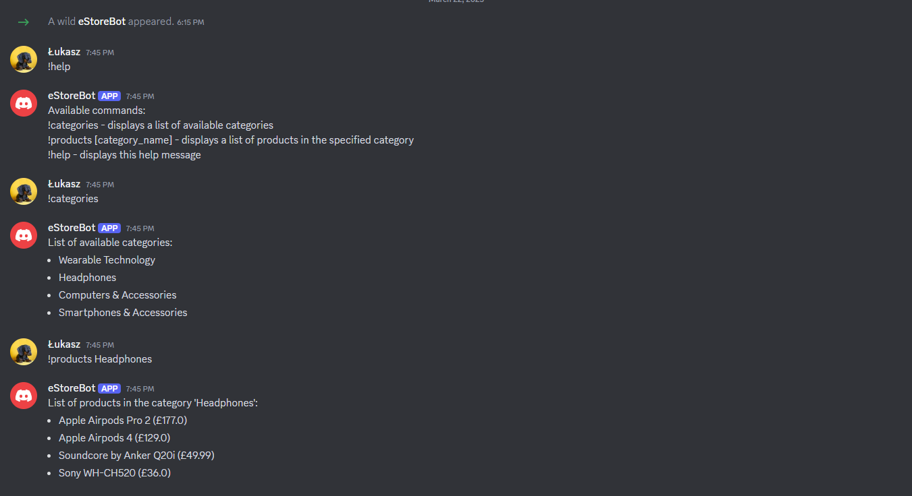

# Zad. 3 - Kotlin

- [x] 3.0 - Należy stworzyć aplikację kliencką w Kotlinie we frameworku Ktor, która pozwala na przesyłanie wiadomości na platformę Discord
- [x] 3.5 - Aplikacja jest w stanie odbierać wiadomości użytkowników z platformy Discord skierowane do aplikacji (bota)
- [x] 4.0 - Zwróci listę kategorii na określone żądanie użytkownika
- [x] 4.5 - Zwróci listę produktów wg żądanej kategorii
- [ ] 5.0 - Aplikacja obsłuży dodatkowo jedną z platform: Slack, Messenger, Webex

## Uruchomienie
1. Zamienić `<your_discord_bot_token>` na token bota w pliku `src/main/kotlin/com/example/Application.kt`
2. Uruchomić aplikację za pomocą komendy 

```./gradlew run```
3. Wysłać odpowiednią wiadomość na kanał, na którym jest zainstalowany bot, `!help`, aby uzyskać pomoc

## Przykładowe użycie


